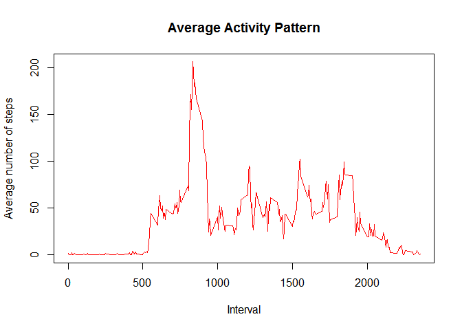
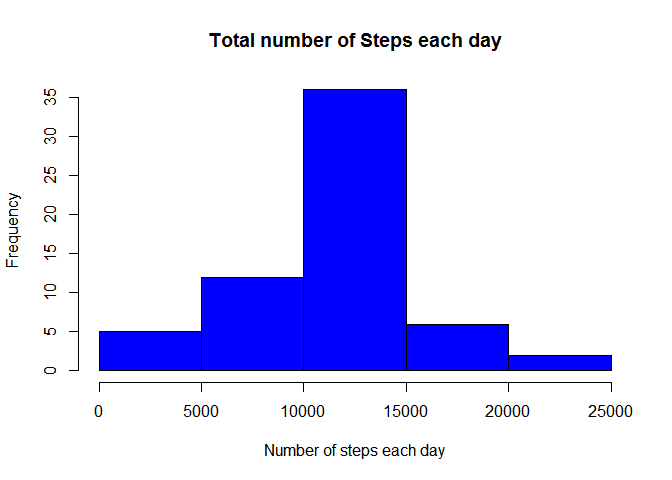

# Reproducible Research: Peer Assessment 1
This assignment makes use of data from a personal activity monitoring device. This device collects data at 5 minute intervals through out the day. The data consists of two months of data from an anonymous individual collected during the months of October and November, 2012 and include the number of steps taken in 5 minute intervals each day.

## Loading and preprocessing the data
###Unzipping and Reading data

```r
filename<- "repdata-data-activity.zip"
unzip(filename)
activity<- read.csv("activity.csv",stringsAsFactors = FALSE)
```
###Calculating mean of total number of steps taken per day

```r
total_steps<-aggregate(activity$steps,list(activity$date),mean,na.rm=TRUE)
colnames(total_steps)<- c("Date","Total_Steps")
```
###Histogram of the total number of steps taken each day

```r
hist(total_steps$Total_Steps,main = "Total number of Steps each day", xlab= "Number of steps each day",col = "purple")
```


## What is mean total number of steps taken per day?

```r
mean(total_steps$Total_Steps,na.rm=TRUE)
```

```
## [1] 37.3826
```

```r
median(total_steps$Total_Steps,na.rm= TRUE)
```

```
## [1] 37.37847
```

## What is the average daily activity pattern?
###Calculating Average daily activity pattern

```r
average_activity<- aggregate(activity$steps,list(activity$interval),mean,na.rm=TRUE)
colnames(average_activity)<- c("Interval","Average_Steps")
```
###Plotting average number of steps across all days

```r
plot(average_activity$Interval,average_activity$Average_Steps,type="l",col = "red",main= "Average Activity Pattern",xlab="Interval",ylab="Average number of steps")
```


###5-min interval that contains maximum number of steps

```r
max_position <- which(average_activity$Average_Steps == max(average_activity$Average_Steps))
max_interval <- average_activity[max_position, 1]
print(max_interval)
```

```
## [1] 835
```


##Imputing missing values
###Total number of missing values in the dataset

```r
sum(is.na(activity))
```

```
## [1] 2304
```
###Filling in all of the missing values in the dataset

```r
imputed_data <- activity
for (i in 1:nrow(imputed_data)){
  if (is.na(imputed_data$steps[i])) {
    imputed_data$steps[i] <- average_activity[which(imputed_data$interval[i] ==average_activity$Interval), ]$Average_Steps
  }
}
```
###Calculating number of steps

```r
numberofsteps<-aggregate(imputed_data$steps,list(imputed_data$date),sum)
colnames(numberofsteps)<- c("Date","Total_Steps")
```
###Histogram of the total number of steps taken each day

```r
hist(numberofsteps$Total_Steps,main = "Total number of Steps each day", xlab= "Number of steps each day",col = "blue")
```


###Mean and Median of total number of steps taken per day

```r
mean(numberofsteps$Total_Steps)
```

```
## [1] 10766.19
```

```r
median(numberofsteps$Total_Steps)
```

```
## [1] 10766.19
```

## Are there differences in activity patterns between weekdays and weekends?

```r
imputed_data$date<- as.Date(imputed_data$date)
weekday<- weekdays(imputed_data$date)
weekdaylevel <- vector()
for (i in 1:nrow(imputed_data)){
     if(weekday[i] == "Saturday") {
        weekdaylevel[i] <- "Weekend"
   } else if (weekday[i] == "Sunday") {
        weekdaylevel[i] <- "Weekend"
      } else {
        weekdaylevel[i] <- "Weekday"
  }
}       
imputed_data$weekdaylevel <- weekdaylevel
imputed_data$weekdaylevel <- factor(imputed_data$weekdaylevel)
```
###Calculating steps by day level

```r
steps_daylevel <- aggregate(steps ~ interval + weekdaylevel, data = imputed_data, mean)
colnames(steps_daylevel) <- c("interval", "weekdaylevel", "steps")
```
###plotting timeseries plot

```r
library(lattice)
xyplot(steps ~ interval | weekdaylevel, steps_daylevel, type = "l", layout = c(1, 2), 
       xlab = "Interval", ylab = "Number of steps")
```


